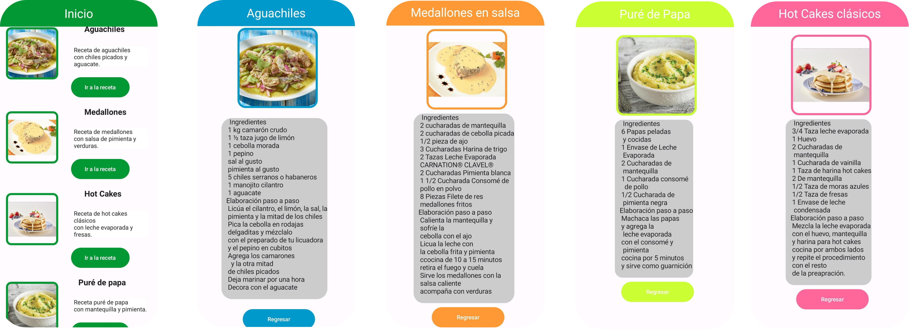

<h1>Recetario</h1>
<h2>Objetivo</h2>

Proyecto realizado para la clase de Android, enfocado en la creación de un recetario.

El objetivo de este proyecto es aprender acerca de la navegación dentro de una aplicación en android así como también sobre los componentes que la integran.

<h3>Funcionalidad</h3>

La aplicación posee un menú inicial el cuál presenta las diversas recetas a las que se puede acceder indicando el nombre de la misma y una breve descripción.

Cada receta posee un botón de navegación con la leyenda "Ir a la receta", lo cual automaticamente nos direccionará a la receta en cuestión

Una vez visualizada la receta, es posible observar de forma detallada diversos componentes de la misma como lo son: 

<ul>
  <li>Una imagen de la receta</li>
  <li>La receta per se (ingredientes y pasos a seguir)</li>
  <li>Botón de regreso al menú inicial </li>
</ul>

<h3>Experiencia al desarrollar el proyecto</h3>

Considero como enriquecedora esta experiencia al ser una introducción al desarrollo en Android y Kotlin,

brindandome herramientas para desarrollar a futuro diversos proyectos poniendo en práctica el aprendizaje adquirido.

<h3>Capturas de pantalla de la aplicación</h3>

